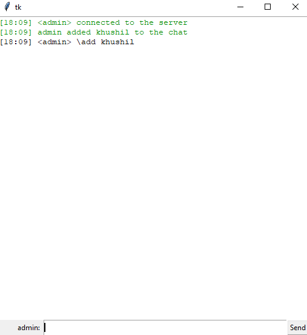
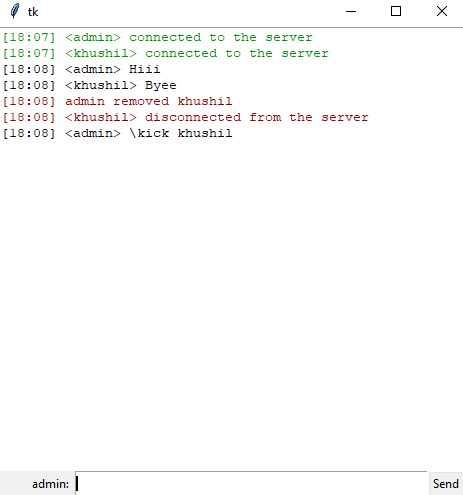
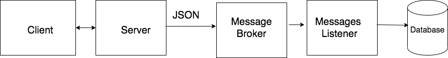
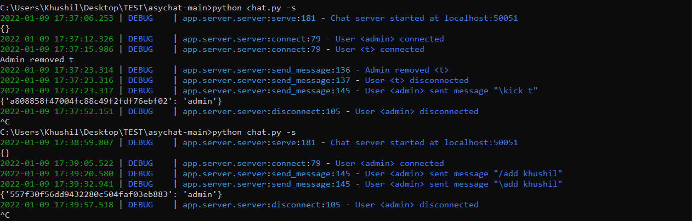
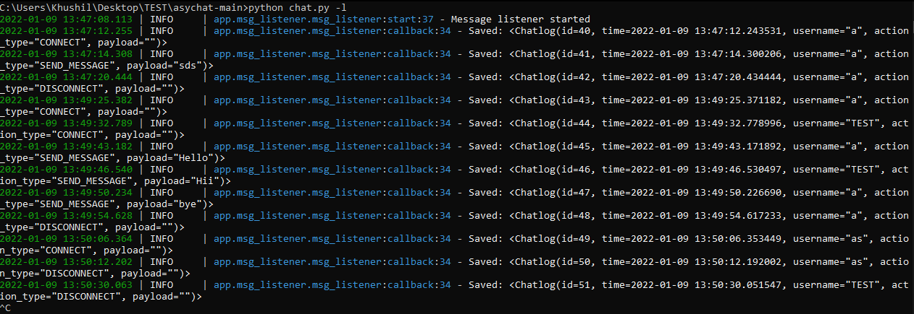

# Stack

- Python3
- [gRPC](https://grpc.io/)
- [RabbitMQ](https://www.rabbitmq.com/)
- [SQLAlchemy](https://www.sqlalchemy.org/)
- [SQLite](https://www.sqlite.org/index.html)
- [threading](https://docs.python.org/3/library/threading.html)
- [loguru](https://github.com/Delgan/loguru)
- [tkinter](https://docs.python.org/3/library/tkinter.html)

## Desctiption
The main goal was to create online chat with client-server architecture.

- User that wants to chat should only type in his nickname. After that, he will be connected to the server and can chat with other members.

- App allows users to see when someone connected or disconnected from the chat.

- All interaction log between clients and server records to database.

Admin

- User with nickname admin can add or remove users.
### add users
	
	\add <user>



### remove user

	\kick <user>
	



## Architecture


Client and Server communicate only by gRPC. 

Every time Server get request from Client, he sends log info to Message Broker (RabbitMQ). 

Log information sends in JSON format to single queue "chat_events" in Message Broker.

Message Listener subscribes to "chat_events" queue. And when some information comes in, he saves it in the Database.

## Setup

Install requirements:

    pip3 install -r requirements.txt

## RabbitMQ server

To track Message Listener status you can open RabbitMQ panel in browser: http://127.0.0.1:15672 (login and password is ```guest```)

### Run Server and Message Listener

    python3 chat.py -s
    python3 chat.py -l

## Server log demo



## Message Listener log demo

	
### Run clinets

Open chat client:

    python3 chat.py
    
